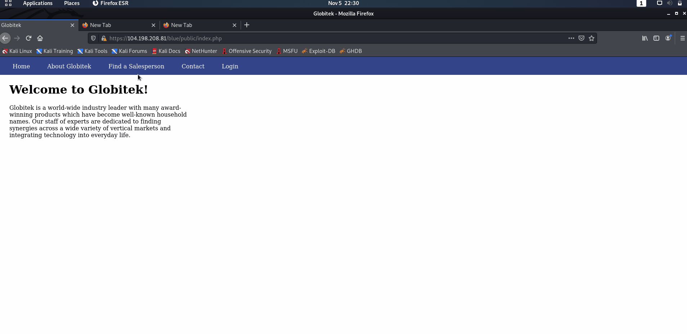
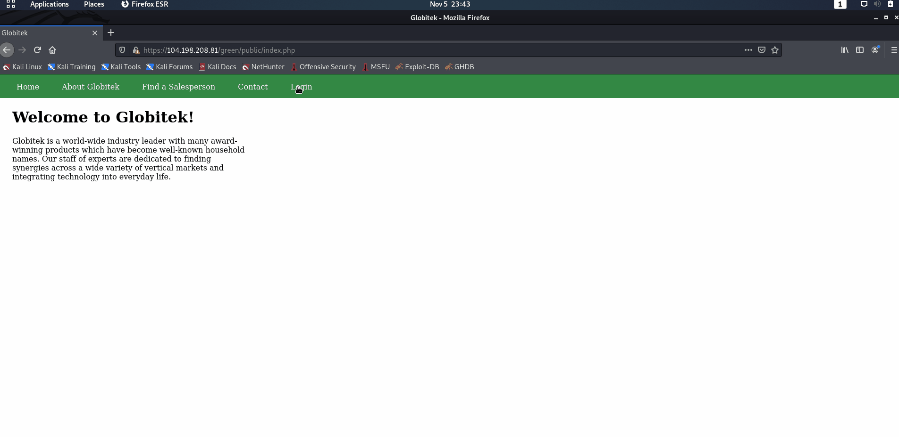
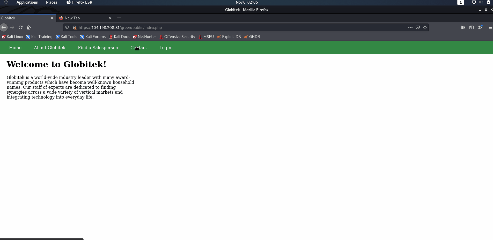
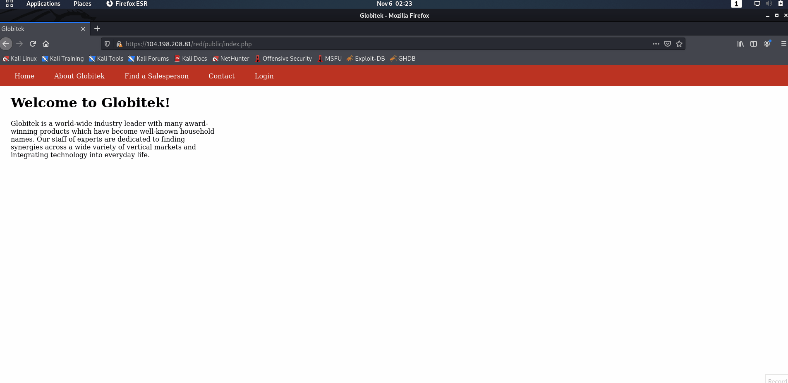

# Project 8 - Pentesting Live Targets

Time spent: **5** hours spent in total

> Objective: Identify vulnerabilities in three different versions of the Globitek website: blue, green, and red.

The six possible exploits are:

* Username Enumeration
* Insecure Direct Object Reference (IDOR)
* SQL Injection (SQLi)
* Cross-Site Scripting (XSS)
* Cross-Site Request Forgery (CSRF)
* Session Hijacking/Fixation

Each color is vulnerable to only 2 of the 6 possible exploits. First discover which color has the specific vulnerability, then write a short description of how to exploit it, and finally demonstrate it using screenshots compiled into a GIF.

## Blue

Vulnerability #1: SQL Injection (SQLi)

Description: Injected two SQL commands instead of the Salesperson's ID number at https://104.198.208.81/blue/public/salesperson.php?id= where the SQL commands are 'OR SLEEP(5)=0--' and 'AND NULL' One of the SQL Injections will cause the SQL query to pause for additional time before the information is displayed showing that there is a possible SQL Injection and information retrievable in the database. The other SQL Injection will cause the database query failed.

Vulnerability #2: Session Hijacking/Fixation

Description: Session Hjacked and Fixation by copying the PHPSESSIONID from an admin logged account and changing the PHPSESSIONID to the attacker unlogged account. Accessed the account login at https://104.198.208.81/blue/public/ and adjusted the PHPSESSIONID using /hacktools/change_session_id.php

## Green

Vulnerability #1: Username Enumeration

Description:

Vulnerability #2: Cross-Site Scripting (XSS)

Description:

## Red

Vulnerability #1: Insecure Direct Object Reference (IDOR)

Description:

Vulnerability #2: Cross-Site Request Forgery (CSRF)

Description:

## Notes

Describe any challenges encountered while doing the work
