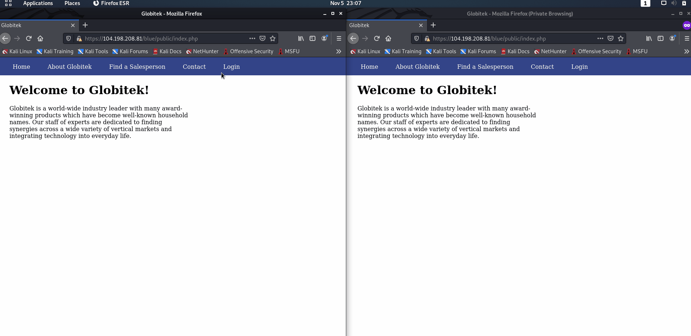

# Project 8 - Pentesting Live Targets

Time spent: **5** hours spent in total

> Objective: Identify vulnerabilities in three different versions of the Globitek website: blue, green, and red.

The six possible exploits are:

* Username Enumeration
* Insecure Direct Object Reference (IDOR)
* SQL Injection (SQLi)
* Cross-Site Scripting (XSS)
* Cross-Site Request Forgery (CSRF)
* Session Hijacking/Fixation

Each color is vulnerable to only 2 of the 6 possible exploits. First discover which color has the specific vulnerability, then write a short description of how to exploit it, and finally demonstrate it using screenshots compiled into a GIF.

## Blue

Vulnerability #1: SQL Injection (SQLi)

Description: Injected two SQL commands instead of the Salesperson's ID number at the URL https://104.198.208.81/blue/public/salesperson.php?id= where the SQL commands are 'OR SLEEP(5)=0--' and 'AND NULL' One of the SQL Injections will cause the SQL query to pause for additional time before the information is displayed showing that there is a possible SQL Injection and information retrievable in the database. The other SQL Injection will cause the database query failed.

Vulnerability #2: Session Hijacking/Fixation

Description: Session Hjacked and Fixation by copying the PHPSESSIONID from an admin logged account and changing the PHPSESSIONID to the attacker unlogged account. Accessed the account login at the URL https://104.198.208.81/blue/public/ and adjusted the PHPSESSIONID using /hacktools/change_session_id.php

## Green

Vulnerability #1: Username Enumeration

Description: Username Enumeration occured when usernames are valid and invalid in the server. For usernames that exist, the unsuccessful login message will be bolded whereas for usernames that does not exist the message will be unbolded. Developers assigned two different span tag classes, failure as bolded style whereas failed as unbolded style in HTML/CSS. Vulnerability can be fixed by keeping span tag classes the same when usernames are valid and invalid in the server.
  

Vulnerability #2: Cross-Site Scripting (XSS)

Description: Pushed a Cross-Site Scripting in the contact feedback form. Inserted the XSS command  and the XSS attack script will run once the administrator account user clicks on the page.
  

## Red

Vulnerability #1: Insecure Direct Object Reference (IDOR)

Description: Insecure Direct Object Reference occured when modifying the id parameter at the URL https://104.198.208.81/red/public/salesperson.php?id= and access were gained in hidden accounts id 10 of Testy McTesterson along with id 11 of Lazy Lazyman by altering the GET request. Developers should check which user accounts are for public or private viewing at the main page and files.

Vulnerability #2: Cross-Site Request Forgery (CSRF)

Description:

## Notes

Describe any challenges encountered while doing the work
